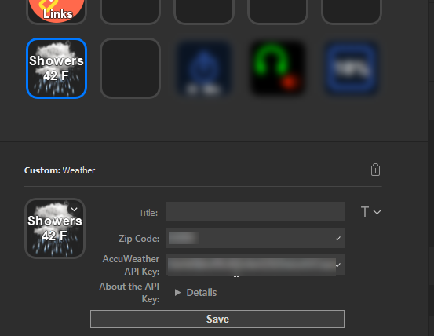
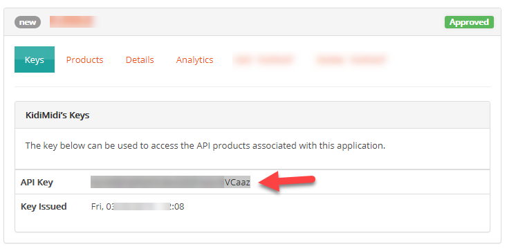

# Weather Plugin for Elgato StreamDeck

StreamDeck is an awesome productivity tool which allows you almost infinite number of customizations. Therefore, I wanted to develop my own plugin to get updates about the weather.

## What is this plugin about?

Weather Plugin gets and displays weather condition on your StreamDeck hourly from AccuWeather. Its dynamic background changes based on the weather. You can see the full list of backgrounds here https://developer.accuweather.com/weather-icons

The plugin is only for informational purposes and does not react key presses. It runs in the background and automatically updates itself at the end of every hour.

This plugin is compatible with both Windows and Mac environments. It is written with the StreamDeck's SDK using JavaScript. 

## Install

Go to https://github.com/tarikguney/weather-plugin-for-elgato-streamdeck/releases and find the latest release. From there, download the `com.tarikguney.weather.streamDeckPlugin` file to your computer. Simply double click on it and it will be automatically installed and be available on StreamDeck application under Custom actions tab.

## Settings

You can change the settings using the property inspector pane on StreamDeck application. Let's look at the image below which shows which settings are available and how the plugin looks when working:

#### `Title`

It does not have any effect. The title is automatically set with the current weather condition including the temperature.

#### `AccuWeather API Key`

Unfortunately, AccuWeather offers only 50 calls per day for each plugin with free AccuWeather accounts. This plugin makes calls to the AccuWeather API to get the hourly weather information to display it on the StreamDeck canvas. Therefore, you need to create your own account and obtain API Key. It is really simple:

1. Create your account here: https://developer.accuweather.com
2. Go to https://developer.accuweather.com/user/me/apps and create an App which will be associated with an API Key that you need to copy and paste here.

Check out the image below:

#### `Country Code`

AccuWeather, when forming the API Url, expects a country code to be passed as part of the Url. In order to reduce the calls to keep the daily number of calls within limits, I need you to find your country code in this list: https://developer.accuweather.com/countries-by-region and copy that to the Country Code field. That's all!

A country code is a shortened version of the country name. For instance, it is `US` for the United States of Ameriica, and `DE` for `Germany`.

#### `Zip Code`

It is pretty clear as to what it is, however, only the USA Zip Codes are supported currently. This field is also known as Postal Code in different parts of the world.

## Problem?

Please report your issues here https://github.com/tarikguney/weather-plugin-for-elgato-streamdeck/issues. I will be working on this plugin for a while to make it even better. I would appreciate if you let me know the problems you run into during your usage.

## Developed By

@tarikguney with <3

I like my StreamDeck and as a software engineer, it intrigued me to develop something for it. This weather plugin is just a start. I will be adding more plugins, primarily for my own use cases, but I will share them on my Github profile for everyone to use.

## Donation?
If you really like this plugin and buy me a book or something, my PayPal account is atarikguney@gmail.com. 